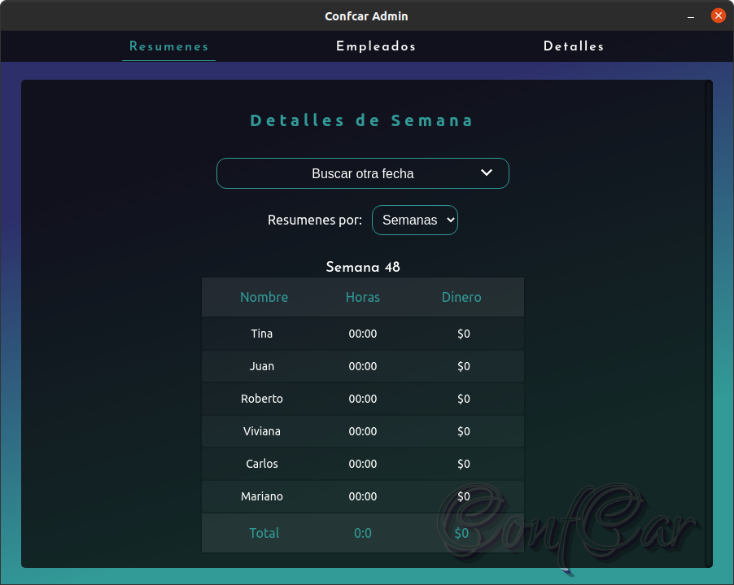
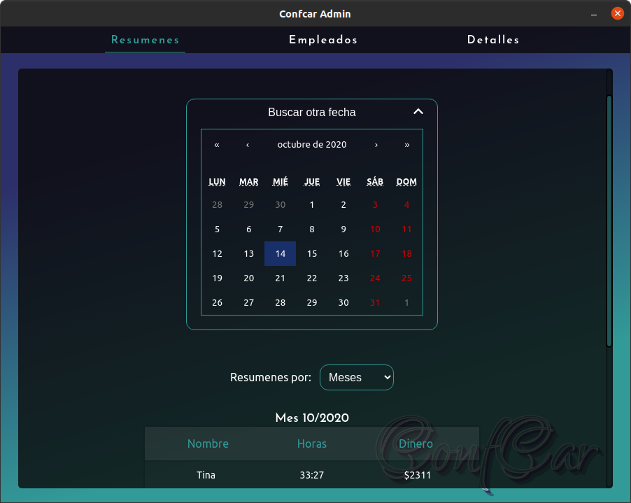
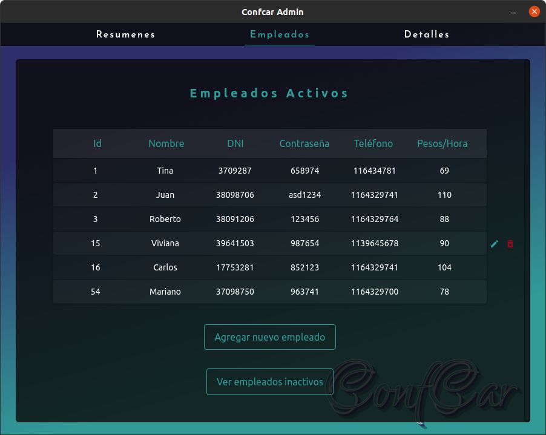
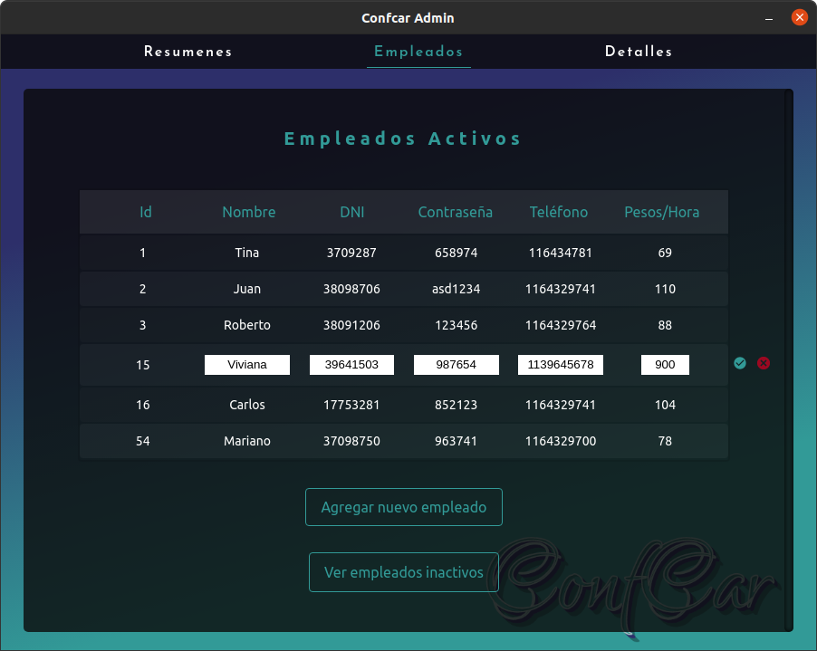
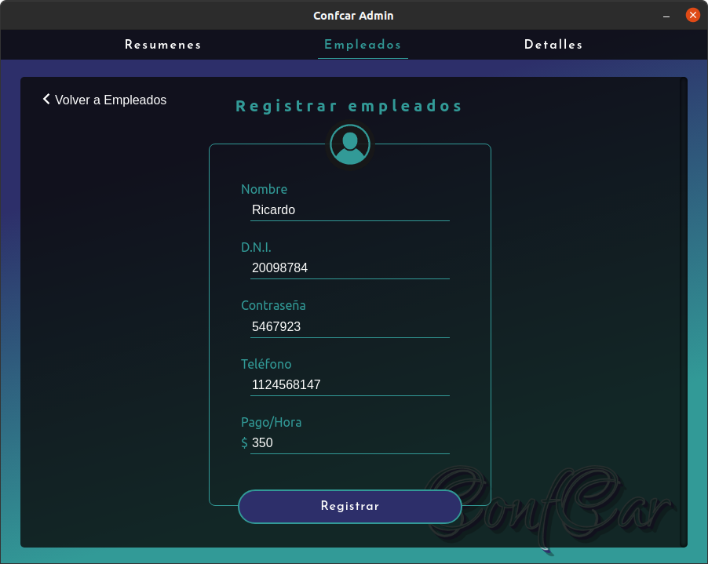
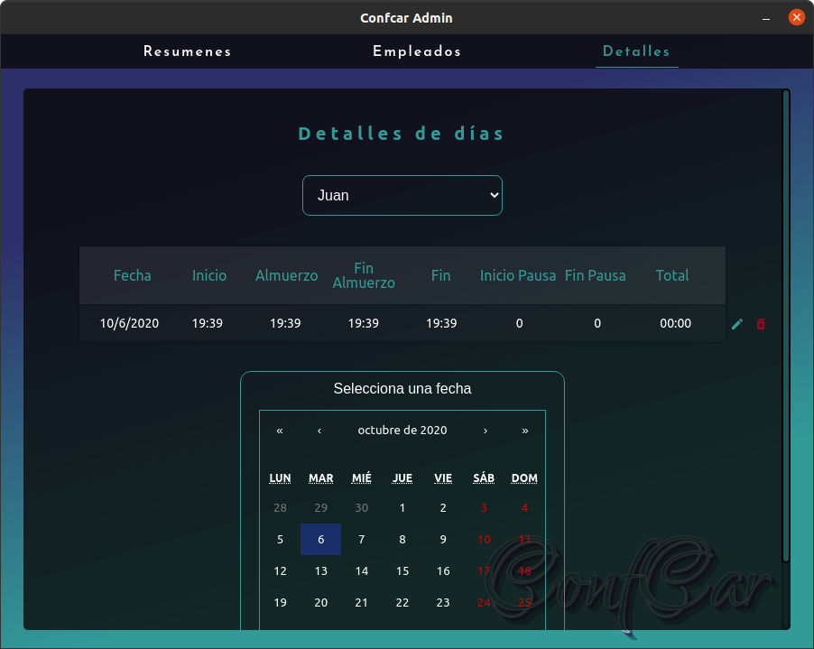
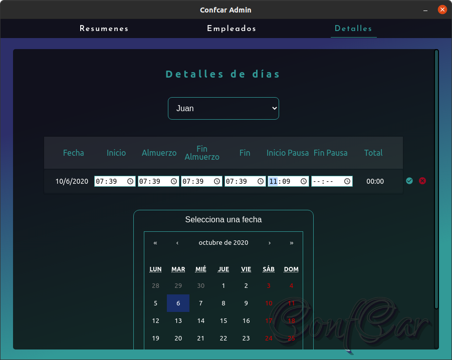

# Confcar admin's Work Schedule Marker electron client

## Freelance project for a SME.

Confcar is a small business of bed sheets.

## Preview screenshots

_Work in Progress_

## Other links

* Backend: [https://github.com/SylphidZoul/Confcar-Backend](https://github.com/SylphidZoul/Confcar-Backend)
* AndroidClient: [https://github.com/SylphidZoul/Confcar-AndroidClient](https://github.com/SylphidZoul/Confcar-AndroidClient)

## Tools 

* [react](https://es.reactjs.org/)
* [react-router-dom](https://www.npmjs.com/package/react-router-dom)
* [concurrently](https://www.npmjs.com/package/concurrently)
* [wait-on](https://www.npmjs.com/package/wait-on)
* [electron](https://www.electronjs.org/)
* [electron-packager](https://github.com/electron/electron-packager)
* [electron-is-dev](https://www.npmjs.com/package/electron-is-dev)
* [axios](https://www.npmjs.com/package/axios)
* [react-calendar](https://www.npmjs.com/package/react-calendar)
* [styled-components](https://www.npmjs.com/package/styled-components)
* [standard](https://standardjs.com/) - linter.
* [jest](https://jestjs.io/) - testing
* [enzyme](https://enzymejs.github.io/enzyme/) - testing
* [enzyme-to-json](https://www.npmjs.com/package/enzyme-to-json) - testing snapshots
